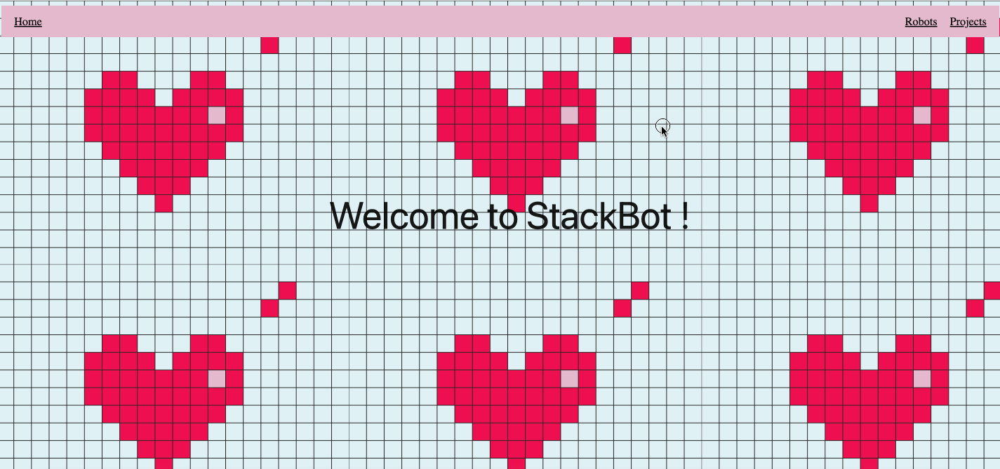
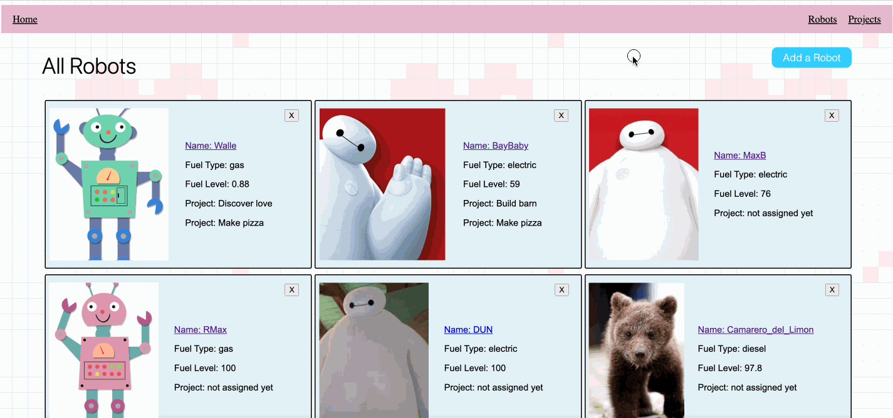
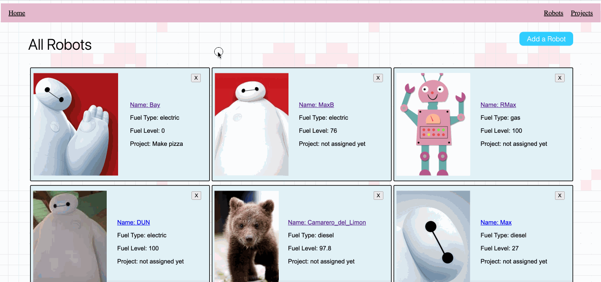
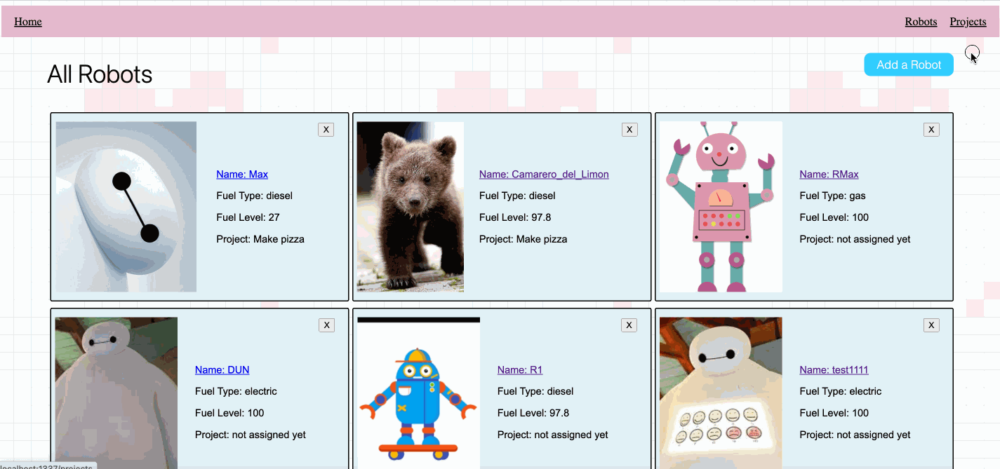

This is my first project. As I am still learning more on UI, through the link here find other things that I am working on.

# Valentine's Special: Robot/Project ManagementTool
We run StackBots Inc., a business staffed entirely by robots. Each robot may be assigned to several projects at a time. I created a RESTful web platform that allows us to manage our robots and projects. 

The key features of the StackBots Website is as follows. 
1. Homepage. You may navigate through "Home", "Robots" and "Projects" on top.

2. Create new employee robot.

3. View details of single robot. Edit each detail of selected robot as well as assign or unassign projects under single robot. 

4. Remove the single robot card from the all robots list.

5.  Same functions are available to manage projects. 

## Getting started

1. `npm install`.
2. Create `final_project` and `final_project_test` databases.
3. `npm run seed`
4. Start the build process and application with: `npm run start-dev`. If you're using Windows, you may need to execute `npm run start-server` and `npm run build-watch` separately (in their own terminal tabs).
5. If you navigate to [localhost:1337](http://localhost:1337), you should see the UI.

